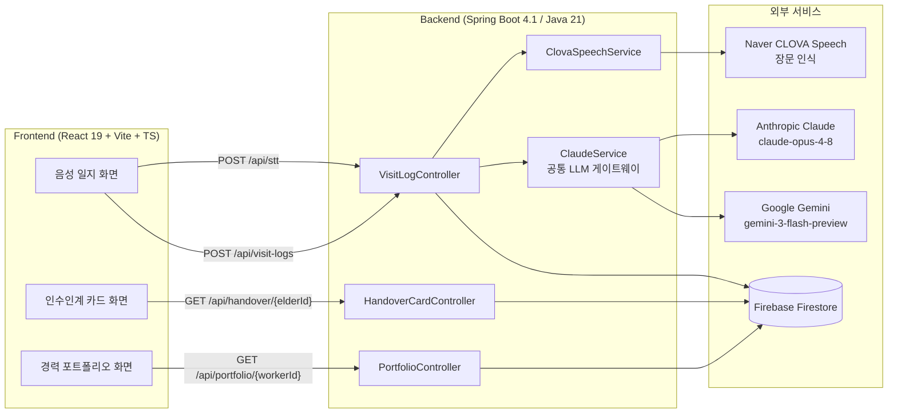

# 케어EZ (CareEZ) — 기술 개요 문서

> 노인맞춤돌봄서비스 생활지원사(SW)·전담사회복지사(ADMIN) 업무 지원 플랫폼
> 작성 기준: `main` 브랜치 (커밋 `16966a0`) · 2026-07-16
> 팀 레포: https://github.com/io-uty/Tech4Good

---

## 1. 프로젝트 개요

돌봄 현장의 세 가지 구조적 문제를 겨냥한다.

| # | 문제 | 대응 기능 | 담당 |
|---|---|---|---|
| 1 | 방문일지·상담기록 등 행정 서류 작성에 업무시간 과다 소모 | **음성 일지 서식화** | 박수지 |
| 2 | 잦은 인력 이탈(1년 단위 계약직)로 인한 경력 증명 부담 | **AI 경력 포트폴리오** | 정현민 |
| 3 | 담당자 교체 시 어르신의 정성적 맥락(성향·정서 트리거) 유실 | **인수인계 카드** | 신승민 |

기능1이 생성하는 `visitLogs`가 기능3의 입력이 되고, 기능2는 동일한 `visitLogs`를 다른 축(개인 근무 이력)으로 집계한다. 세 기능 모두 하나의 공통 모듈(`ClaudeService`)을 통해서만 LLM을 호출한다.

---

## 2. 시스템 아키텍처



**LLM 이중화**: `ANTHROPIC_API_KEY`가 설정되어 있으면 Claude(Structured Outputs)를, 없고 `GOOGLE_API_KEY`만 있으면 Gemini(JSON 모드 + 클래스 기반 스키마 프롬프트 삽입)를 선택한다. 두 구현 모두 동일한 `ClaudeService` 인터페이스를 만족하므로 상위 기능 코드는 어느 provider가 붙어도 수정이 필요 없다.

---

## 3. 기술 스택

| 영역 | 선택 | 비고 |
|---|---|---|
| Frontend | React 19, TypeScript, Vite 8, TailwindCSS 4, Recharts, lucide-react | FSD(Feature-Sliced Design) 유사 구조 (`entities/pages/shared/widgets`) |
| Backend | Spring Boot 4.1.0, Java 21, Gradle 9(wrapper) | Boot 4는 Jackson 3 기반이라 Jackson 2 `ObjectMapper`를 별도 Bean으로 등록(`JacksonConfig`) |
| DB | Firebase Firestore (Admin SDK 9.4.3) | Jackson `convertValue` 기반 수동 매핑 (Firestore POJO 매핑 미사용) |
| STT | Naver CLOVA Speech (장문 인식, sync) | CSR(60초/10MB) 대신 장문 인식(최대 2시간/2GB) 사용 |
| LLM | Anthropic Claude (`anthropic-java` 2.34.0) / Google Gemini (HttpClient 직접 호출) | victools jsonschema-generator 4.37.0으로 Gemini용 스키마 생성 |

---

## 4. Firestore 데이터 모델

```
elders (어르신)
  elderId, name, birthDate, address, guardianContact, createdAt, updatedAt

careWorkers (생활지원사)
  workerId, name, org, hireDate, contractEndDate, assignedElderIds[]
  attendanceMonthly[], certificates[], experiences[]   ← 기능2 확장 필드 (실 근태 시스템 부재로 더미 시드)

visitLogs (방문일지) — 기능1 산출물 / 기능2·3 입력
  logId, elderId, workerId, visitDateTime, rawSttText
  structuredLog { serviceType, activityDetail, elderCondition, specialNote }   ← CLAUDE.md §4 원안, 기능3 호환용
  body, food, emotion, cognition, journalEntry, briefSummary[]                 ← 기능1 신규 API 산출 필드
  riskTags[], status("draft"|"confirmed"), confirmedBy, confirmedAt

handoverCards (cardId, elderId 기준 버전 이력)
  elderId, generatedAt, previousWorkerId, newWorkerId, sourceLogRange
  summary { basicInfo, personality, emotionalTriggers[], preferredTopics[], avoidTopics[], recentThreeMonthSummary }
  version, previousVersionId
```

> **구현 노트**: `structuredLog`는 기능1 개발 과정에서 `body/food/emotion/cognition/journalEntry`로 필드가 재편되었고, 기능3(`HandoverPrompts`)과의 하위 호환을 위해 `VisitLogService`가 신규 필드로부터 `structuredLog`를 자동 파생하여 함께 저장한다. 두 스키마가 한 문서에 공존하는 과도기 상태다.

> **CLAUDE.md §7 대비 차이**: 명세는 `careerRecords` 컬렉션에 stats/timeline을 영속화하도록 정의했으나, 실제 구현(`PortfolioService`)은 매 요청마다 `visitLogs`/`careWorkers`를 실시간 집계·조합해 응답할 뿐 별도 컬렉션에 저장하지 않는다. 기능상 완료 기준(즉시 조회, 3개 이벤트 유형 분류)은 충족하나 캐싱·이력 관리는 없다.

---

## 5. 공통 모듈: ClaudeService

```java
public interface ClaudeService {
    <T> T generateStructured(String systemPrompt, String userPrompt, Class<T> responseType);
}
```

- **검증**: 응답을 `responseType`으로 역직렬화하는 것 자체가 스키마 검증이다. 실패 시 오류 메시지를 프롬프트에 덧붙여 재시도(기본 2회), 최종 실패 시 `ClaudeSchemaValidationException`을 던진다 — **임의값으로 채워 반환하지 않는다.**
- **Claude 경로** (`AnthropicClaudeService`): SDK의 Structured Outputs(`outputConfig(Class)`)로 서버 측 스키마 강제. 모델 `claude-opus-4-8`, `maxTokens=16000`.
- **Gemini 경로** (`GeminiClaudeService`): victools로 응답 클래스에서 JSON Schema를 생성해 system prompt에 삽입하고, `generationConfig.responseMimeType=application/json`으로 호출. 엔드포인트는 `generativelanguage.googleapis.com`(Vertex/`aiplatform`이 아님 — 개인 키 권한 문제로 403 발생 이력 있음).
- **로깅**: 요청/응답 원문을 `logs/claude-io.log`에 기록 (`claude.io-log-path`).
- **Provider 선택** (`LlmConfig`): `ANTHROPIC_API_KEY` 우선 → 없으면 `GOOGLE_API_KEY` → 둘 다 없으면 기동 시점에 명확한 예외를 던지는 스텁 Bean.

---

## 6. 기능별 상세

### 6.1 기능1 — 음성 일지 서식화

```
녹음 파일 → POST /api/stt (CLOVA Speech) → rawText
         → POST /api/visit-logs (rawText, workerId, elderId) → ClaudeService 구조화 → Firestore 저장(status=confirmed)
```

| Method | Endpoint | 설명 |
|---|---|---|
| POST | `/api/stt` | 오디오 파일(`audioFile`, multipart) → STT 텍스트만 반환, 저장 없음 |
| POST | `/api/visit-logs` | `{workerId, elderId, rawText}` → Claude 구조화 → `visitLogs` 저장 후 반환 |

STT는 CLOVA Speech **장문 인식**(`/recognizer/upload`, `X-CLOVASPEECH-API-KEY` 헤더, `completion:"sync"`)을 사용해 최대 2시간 분량까지 처리 가능 — 원래 우려했던 CSR 1분 제한을 우회했다. Multipart 업로드 한도는 `application.properties`에서 100MB로 상향 설정됨.

CLAUDE.md 원안의 `/api/visit-logs/transcribe`, `/draft`, `{logId}/confirm` 4-엔드포인트 구조 대신, 실제로는 STT와 구조화 저장을 2개 엔드포인트로 단순화하고 초안 검토 단계 없이 즉시 `confirmed`로 저장하는 구조로 구현되었다 (아래 §8 참고).

### 6.2 기능2 — 경력 포트폴리오

| Method | Endpoint | 설명 |
|---|---|---|
| GET | `/api/portfolio/{workerId}` | 통계·근태·활동추이·성과·자격증·경력·타임라인을 한 번에 반환 |

- **LLM 미사용 영역**: `stats`, `attendanceStats`, `attendanceMonthly`, `activityTrends`, `carePerformances`, `experiences`, `certificates` — confirmed `visitLogs` 집계 + `careWorkers` 더미 시드값을 그대로 매핑. 비용·지연 없음, 환각 불가능.
- **LLM 사용 영역**: `timeline`만. 신규배정(어르신별 최초 방문일)·위험대응(`riskTags` 존재 로그)·근속마일스톤(입사일 기준 6개월 단위)을 **규칙 기반으로 후보 생성**한 뒤, Claude/Gemini에는 "후보 중에서 의미 있는 사건을 골라 문구만 다듬는" 역할만 맡긴다 — 후보에 없는 사건을 새로 만들어내는 것은 원천 차단. 후보가 40건을 넘으면 최근순 40건만 프롬프트에 담아 응답 지연·토큰 초과를 방지한다.
- CLAUDE.md 원안(`/api/career/{workerId}/stats`, `/timeline/generate`, `/timeline` 3-엔드포인트)과 달리 단일 엔드포인트로 통합됨.
- **데모용 대량 시더**: `DevSeedService`가 `worker-001`에 합성 어르신 120명 × confirmed 방문일지 10건씩(1,200건)을 추가로 시딩해, 총 방문 수·돌봄 시간을 네 자리, 담당 어르신 수를 세 자리 단위로 만든다(가짜 통계값을 덮어쓰는 게 아니라 실제 Firestore 문서 기반 집계). 정성적 시연용 어르신 3명(elder-001~003)의 데이터는 그대로 유지된다.

### 6.3 기능3 — 인수인계 카드

```
[ADMIN] "카드 생성" 트리거
  → confirmed visitLogs 조회(시간순)
  → ClaudeService(§8.4 환각 방지 제약 3종 적용)
  → summary 초안 생성
  → [검토·수정] → confirm
  → handoverCards 새 버전 저장(이전 버전 보존, previousVersionId 체인)
```

| Method | Endpoint | 설명 |
|---|---|---|
| POST | `/api/handover-cards/{elderId}/generate` | 방문일지 기반 카드 초안 생성 |
| PUT | `/api/handover-cards/{cardId}/confirm` | 검토·수정 후 확정 |
| GET | `/api/handover-cards/{elderId}/latest` | 최신 카드 조회 |
| GET | `/api/handover-cards/{elderId}/history` | 버전 이력 조회 |
| GET | `/api/handover-cards/{cardId}/source-logs` | 카드 근거 원본 로그 조회(추적용) |

이 5종을 신규 SW 온보딩 화면(`HandoverDetail.tsx`)에서도 그대로 사용한다 — `latest`가 반환하는 `HandoverCard.summary` 전체(basicInfo/personality/emotionalTriggers/preferredTopics/avoidTopics/recentThreeMonthSummary)를 화면에 그대로 렌더링하는 구조로, 별도의 프론트 전용 축약 API·어댑터는 두지 않았다(§8 참고 — 초기에는 프론트가 다른 축약 스키마를 기대해 임시 어댑터를 만들었으나, 이후 프론트를 원본 계약에 맞춰 재구현하면서 제거됨).

시스템 프롬프트 제약(§8.4 그대로 구현):
1. 로그에 없는 정보 추정 금지, 근거 없으면 필드 비움
2. 정서 트리거는 **서로 다른 로그 2건 이상**에서 유사 패턴 반복 시에만 기록 + `sourceLogIds` 필수
3. 의료 정보(`chronicConditions`/`medications`)는 로그에 명시된 것만 기재
4. 출력은 스키마 그대로, 부가 텍스트 금지

---

## 7. 검증 현황

`HandoverCardE2ETest` — 실제 Firestore + 실제 LLM(Claude 또는 Gemini)을 호출하는 통합 테스트. 키가 없으면 `Assumptions`로 자동 skip.

| 검증 항목 | 방법 | 결과 |
|---|---|---|
| 정서 트리거 근거 2건 이상 + 유효한 logId만 참조 | 시더로 심은 반복 패턴(배우자 기일, 우천 시 통증 등) 대비 검증 | ✅ 통과 |
| 환각 방지 — 로그에 없는 병명/약물 미생성 | 카드 필드의 모든 토큰이 원본 로그 corpus에 존재하는지 검사 | ✅ 통과 (미언급 항목은 실제로 공란) |
| 버전 체인 — 재생성 시 이전 버전 보존 | `version+1`, `previousVersionId` 연결, 구버전 문서 존속 확인 | ✅ 통과 |

더미 시더(`DevSeedService`)는 어르신 3명 · confirmed 방문일지 20건을 고정 ID로 멱등 생성하며, 반복 트리거·1회성 언급(트리거로 잡히면 안 됨)·명시된 지병/복약을 의도적으로 심어 위 검증을 가능하게 한다.

**빌드 상태**: `./gradlew compileJava` 기준 전체 소스 컴파일 성공 (기능1·2 병합 이후 기준 재확인).

---

## 8. 프론트엔드 연동 상태 점검 ✅ (조치 완료)

프론트엔드(`frontend/src/shared/api/index.ts`)가 실제로 호출하는 엔드포인트와 백엔드 구현을 전수 대조하고, 발견된 불일치를 모두 해소했다. `fetch` 실패 시 콘솔 경고와 함께 하드코딩된 mock으로 폴백하도록 짜여 있어 **연동이 깨져 있어도 화면은 정상처럼 보이는 구조**였기 때문에, 아래 점검이 없었다면 데모에서 실데이터가 아닌 mock이 노출될 뻔했다.

| 기능 | 프론트가 호출하는 API | 백엔드 실제 API | 상태 |
|---|---|---|---|
| 음성 일지(STT) | `POST /api/stt` | `POST /api/stt` | ✅ 일치 |
| 음성 일지(저장) | `POST /api/visit-logs` | `POST /api/visit-logs` | ✅ 일치 |
| 방문일지 목록 | `GET /api/visit-logs/{elderId}` | `GET /api/visit-logs/{elderId}` | ✅ 일치 |
| 경력 포트폴리오 | `GET /api/portfolio/{workerId}` | `GET /api/portfolio/{workerId}` | ✅ 일치 (아래 조치 참고) |
| 인수인계 카드 | `GET /api/handover-cards/{elderId}/latest` | `GET /api/handover-cards/{elderId}/latest` | ✅ 일치 |

**초기 발견 당시**에는 프론트가 `{elderId, name, careYears, tips[]}` 단순 구조를 기대하고 `/api/handover/{elderId}`라는 존재하지 않는 경로를 호출하고 있었다(백엔드는 CLAUDE.md §8.1 원안대로 `basicInfo/personality/emotionalTriggers[]/...`를 담은 `HandoverCard`를 5개 ADMIN 엔드포인트로만 노출). 임시로 어댑터 엔드포인트(`HandoverViewController`)를 만들어 우회했으나, 이후 팀원이 프론트를 `HandoverCard` 전체 스키마(`summary.basicInfo/personality/emotionalTriggers/preferredTopics/avoidTopics/recentThreeMonthSummary`)를 그대로 소비하도록 `HandoverDetail.tsx`를 다시 구현하고 `getHandover()`가 `/api/handover-cards/{elderId}/latest`를 직접 호출하도록 고쳐서 정식으로 병합했다 — 어댑터는 불필요해져 삭제했다. 최종적으로는 **프론트가 백엔드 원본 계약에 맞춰졌다**(반대 방향인 어댑터 우회가 아니라).

**포트폴리오 workerId 불일치**: 프론트(`PortfolioPage.tsx`)가 `getPortfolio("worker-1")`을 호출하는데 시더가 만드는 실제 문서 ID는 `worker-001`이라, 실제로는 매번 빈 통계가 내려오고 있었다. 프론트 하드코딩 값을 `worker-001`로 수정해 실데이터와 일치시켰다.

**Vite 프록시 부재**: `frontend/vite.config.ts`에 `/api` 프록시 설정이 전혀 없어, 개발 서버(5173)에서 `fetch("/api/...")`가 자기 자신(5173)으로 가서 항상 실패 → mock 폴백으로 빠지는 구조였다. `server.proxy['/api'] → http://localhost:8080`을 추가해 백엔드로 정상 포워딩되도록 했다(동일한 수정이 팀원 쪽에서도 독립적으로 이뤄져 병합 시 정리됨).

**음성 일지 STT 미연동**: `VoiceLogPage.tsx`가 실제로는 마이크 녹음을 하지 않고 더미 텍스트를 오디오인 척 전송하고 있었다. 팀원이 Web Audio API로 16kHz mono PCM WAV를 직접 인코딩하는 방식(`MediaRecorder`의 기본 webm/opus 출력은 CLOVA가 인식하지 못함)으로 재구현해 병합했다.

이 항목들 중 하나라도 방치했다면 화면은 그럴듯하게 뜨지만 실제로는 대부분 mock 데이터로 녹화될 뻔했다는 점에서, **"화면이 뜬다"와 "실데이터로 연동된다"는 이 프로젝트 구조상 별개로 검증해야 한다**는 게 핵심 교훈이다.

---

## 9. 보안 및 비밀 관리

- `backend/.env`, `backend/*firebase-adminsdk*.json`은 `.gitignore`에 등록되어 있으며, git 히스토리 전체(`--all --full-history`)를 확인한 결과 **한 번도 커밋된 적 없음**을 확인했다.
- `backend/.env.example`에 필요한 키 목록(ANTHROPIC_API_KEY, FIREBASE_CREDENTIALS_PATH, CLOVA_SPEECH_INVOKE_URL, CLOVA_SPEECH_SECRET_KEY)만 placeholder로 커밋되어 있어 팀원 온보딩용으로 적절하다.
- CLOVA Speech Secret Key, Firebase 서비스 계정 키는 로컬 `.env`/JSON 파일로만 보관 중이며 본 문서에도 값은 기재하지 않았다.

---

## 10. 로컬 실행 가이드

```bash
# 1) 환경변수 준비
cp backend/.env.example backend/.env
# ANTHROPIC_API_KEY(또는 GOOGLE_API_KEY), FIREBASE_CREDENTIALS_PATH,
# CLOVA_SPEECH_INVOKE_URL, CLOVA_SPEECH_SECRET_KEY 채우기

# 2) 백엔드 기동
cd backend
./gradlew bootRun        # Windows: gradlew.bat bootRun

# 3) 더미 데이터 시딩 (어르신 3명 + confirmed 방문일지 20건, 멱등)
curl -X POST http://localhost:8080/api/dev/seed

# 4) 프론트엔드
cd frontend
npm install
npm run dev
```

---

## 11. 남은 작업 요약

| 상태 | 항목 | 비고 |
|---|---|---|
| ✅ 해결 | §8 인수인계 카드 API 계약 정합화 | 프론트가 `HandoverCard` 원본 스키마를 직접 소비하도록 재구현 |
| ✅ 해결 | §8 포트폴리오 workerId 불일치 | 프론트 하드코딩 `worker-1` → `worker-001` 수정 |
| ✅ 해결 | §8 Vite `/api` 프록시 부재 | `vite.config.ts`에 프록시 추가 |
| ✅ 해결 | §8 음성 일지 STT 미연동 | 더미 blob 대신 Web Audio API 기반 16kHz WAV 실녹음으로 재구현 |
| 🟡 Medium | 기능1 초안 검토(draft) 단계 부재 | 현재 `/api/visit-logs`가 즉시 `confirmed`로 저장 — CLAUDE.md 원안의 "검토·수정 후 확정" UX 없음 |
| 🟢 Low | 기능2 `careerRecords` 영속화 | 현재는 매 요청 실시간 계산 — 기능 자체는 정상 동작 |
| 🟢 Low | PHQ-9 심화조사지 | 스트레치 목표, 미착수 |

---

*이 문서는 코드베이스 정적 분석(파일 구조·git 히스토리·API 계약 대조) 및 `./gradlew compileJava` 빌드 확인을 근거로 작성되었습니다.*
